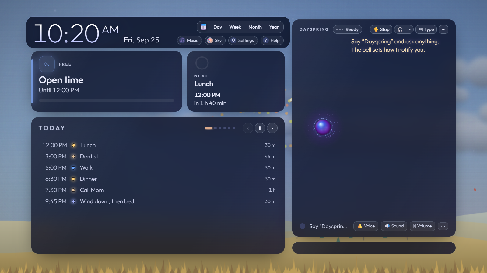
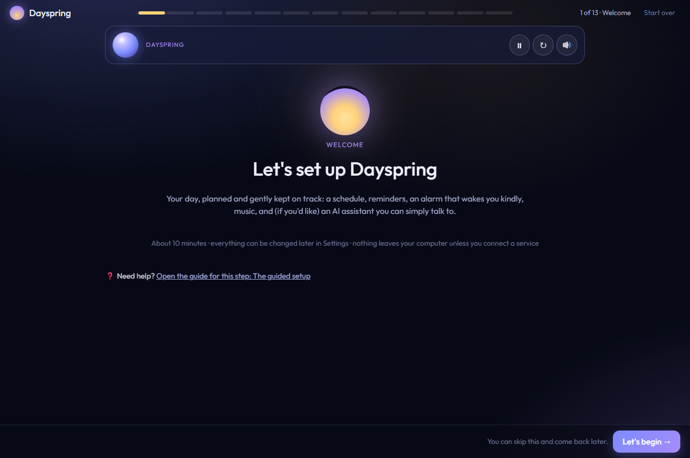
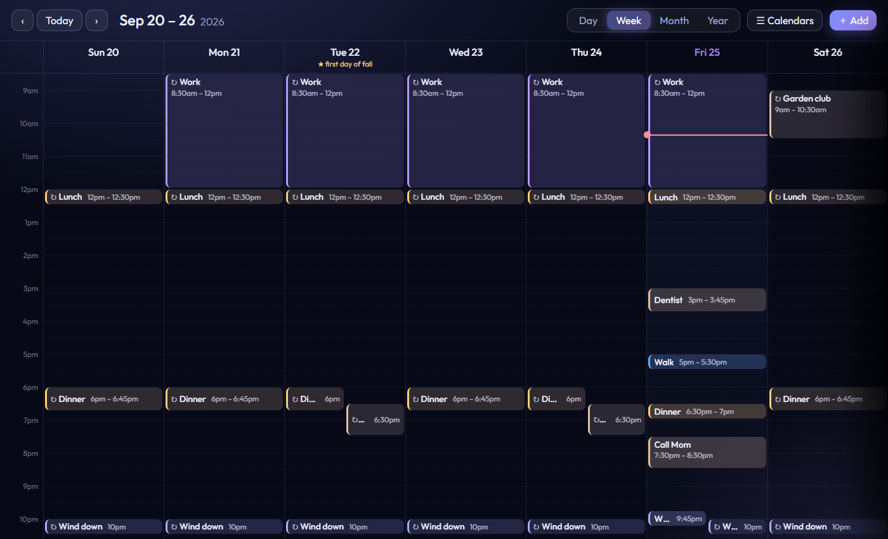
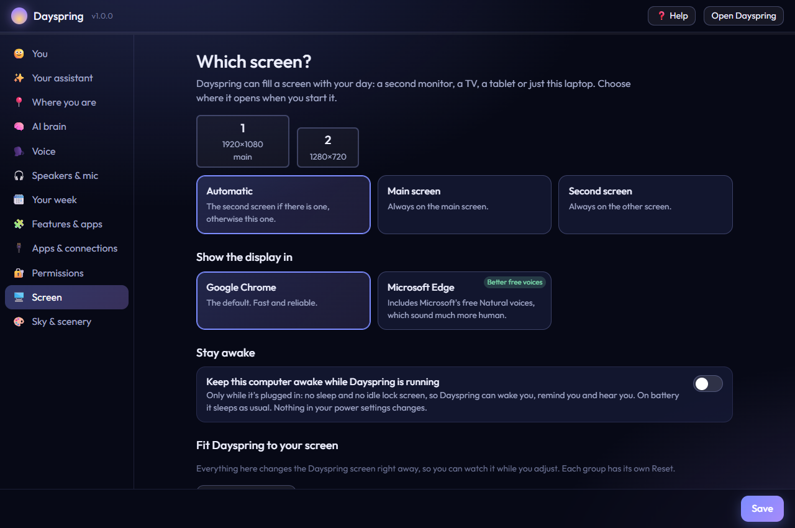
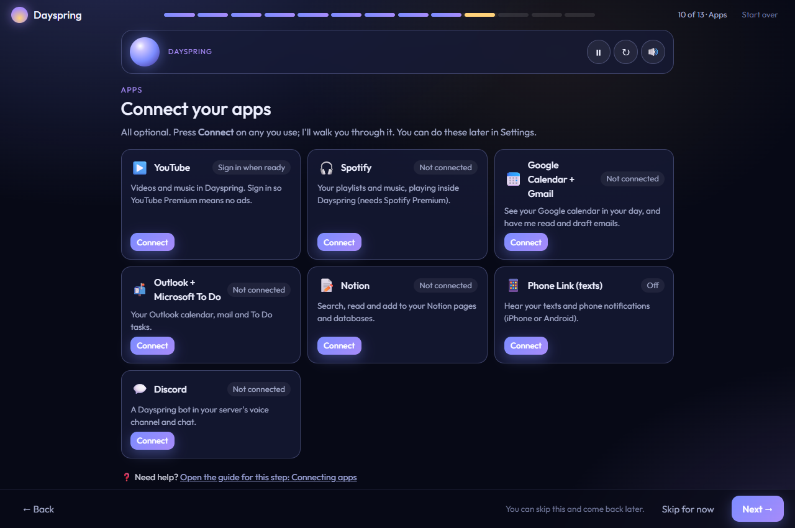
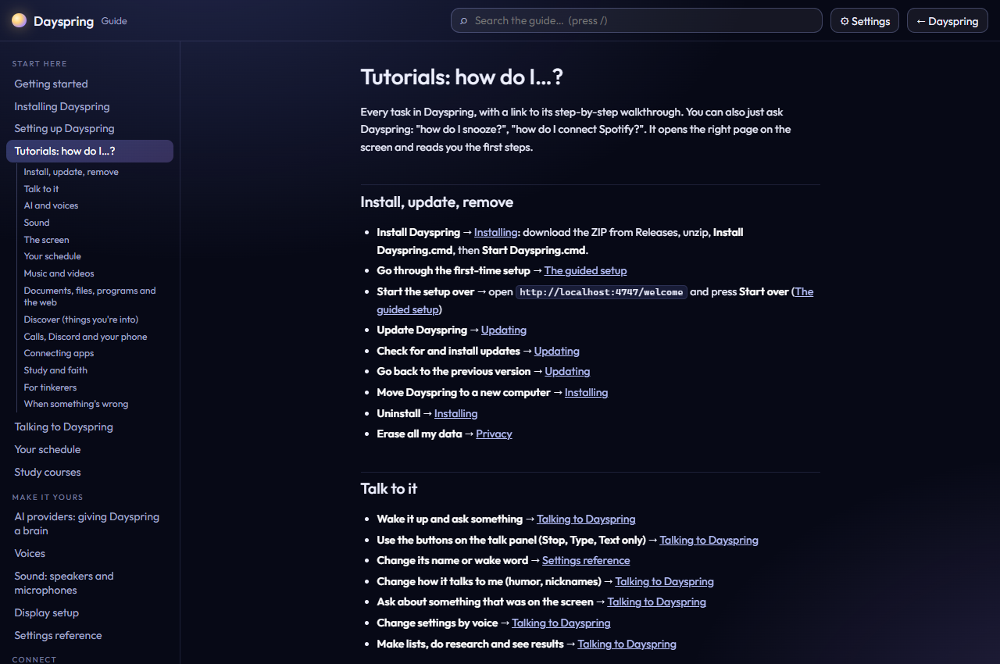

# Dayspring

**A friendly voice assistant and day planner for any screen in your home.** It's free, it runs on your own Windows computer, and your data stays there. Add an AI brain and it gets even better.

Dayspring puts your day on a screen: a spare monitor, a TV, or your laptop. It keeps you on schedule with gentle reminders, and it answers when you talk to it: *"Dayspring, what's on tomorrow?"* · *"Move gym to 7 every time."* · *"Play some calm music."* · *"Remind me to call Mom at noon."* · *"How do I connect Spotify?"*

## ⬇️ Install in 5 minutes

You need Windows 10 or 11 and a web browser (Edge, Chrome, Brave, Firefox…). You don't need a GitHub account or to know anything about code.

1. **Download.** Click **[⬇️ Download Dayspring](https://github.com/juggernautjake/dayspring/releases/latest/download/Dayspring.zip)**. The download starts right away. It's always the newest version.
2. **Unzip.** Open your **Downloads** folder, right-click **Dayspring.zip**, choose **Extract All…**, type `C:\Dayspring` as the place, and click **Extract**.
3. **Install.** In that folder, double-click **Install Dayspring.cmd**. If Windows shows *"Windows protected your PC"*, click **More info → Run anyway**. A black window checks your computer:
   - If it offers to install **Node.js** (the engine Dayspring runs on), type **Y** and press **Enter**. When it finishes, close the window and double-click **Install Dayspring.cmd** once more.
   - Then it downloads Dayspring's parts and adds a **Dayspring** shortcut to your desktop and Start menu.
4. **Start.** Double-click the new **Dayspring** icon on your desktop. Your browser opens the **guided setup**: a friendly voice walks you through your name, an optional AI, a voice, your week, what Dayspring may do, and your screen. Only your name is required; everything else can wait. When the browser asks to use your microphone, click **Allow**.

That's it. Say **"Dayspring"** and ask anything, or press **⌨ Type**.
Step-by-step with pictures and fixes: **[Installing Dayspring](docs/install.md)** · **[The guided setup](docs/setup-wizard.md)**

## What it does

### Your day
- **Schedule app**: day, week, month and year views. Add, edit, drag to move or resize, mark what's important, by voice, by typing or with the mouse. Changes show on the screen right away.
- **Repeating items**: every day, every other day, weekdays, chosen days, every other week, "the first Monday of every month", yearly, with an end date if you like. Change just one day or every time.
- **Say it once**: "cut my free time Saturday to an hour and move everything up" makes every change and tells you when it's done. Work, church and meetings stay put.
- **Reminders, snooze, a morning rundown and a gentle alarm** (with music if you like), plus a night mode.
- **Calendars you already use**: Google, Outlook, iCloud, school and team calendars show on your schedule.

### Talking to it
- **A wake word** ("Dayspring", or any name you give it), free built-in voices (Edge's *Natural* voices sound great), or premium ElevenLabs and OpenAI voices. Switch voices by name.
- **Works without AI**: the schedule, repeats, reminders, snooze, weather, music, documents read aloud and dozens of commands are all free.
- **Optional AI brain**: Claude, ChatGPT, Grok, or Ollama (free and private, on your computer) for real conversation, planning, writing and looking things up.
- **It helps you use it**: ask "how do I snooze?" or "how do I set up the Discord bot?" and the right page of the guide opens on the screen while Dayspring reads you the first steps.
- **Type instead** whenever you like, or switch to Text only.

### Your screen
- **The living sky**: the background follows the real time of day, season and weather where you live, with rain on the glass, snow, falling leaves, starry nights, fields, forests and rivers. Or pick a vibe: Cozy, Calm, Focus, Night owl…
- **A rotating showcase**: today, the week, weather, an encouraging quote, a video worth watching, and your photos (if you choose folders).
- **Discover**: tell it what you're into (woodworking, pickleball, marine wildlife…) and it finds popular new videos, Shorts and articles, never the same one twice.
- **Your way**: an app window, a small **Dayspring mini** for a corner of your desktop, full screen on a TV, or a tab in any browser (Brave and Firefox included). One click makes it **Quiet** or **Off**, and notifications can speak, chime or stay silent, as cards in front of every window.
- **Fits any screen**: 📐 Fit to screen for TVs that crop the edges, sizes, layouts, and a window bar to minimize, hide or close it. It keeps the computer awake while plugged in, without changing your power settings.

### Music, calls, apps and files
- **Music inside Dayspring**: Spotify (Premium) plays right on the screen; YouTube has full controls, a queue, playlists and history.
- **🎧 Tune in**: it listens to your headset during a call or game and answers when someone says its name. Speech-to-text runs on your own computer.
- **A Discord bot** that joins your server's voice channel as its own member.
- **Your phone**: texts and notifications announced through Microsoft Phone Link (iPhone and Android).
- **Connected apps**: Google Calendar and Gmail, Outlook and Microsoft To Do, Notion, Todoist, news and RSS, Home Assistant (lights, thermostats), webhooks (IFTTT, Zapier), and severe weather alerts. It writes drafts but never sends email on its own.
- **Documents read aloud, summarized and explained**: Word, PDF, PowerPoint, Excel, CSV and more. "Read me the lease", "summarize my resume".
- **Your files, programs and a browser it can use for you**, each only if you switch it on, with a backup before any change and the Recycle Bin for deletes.

### And
- **Optional faith features**: a reading plan, prayer list, Scripture memory and church-study helpers. Off unless you turn them on.
- **Study courses**: add your courses; it opens the next lesson and tracks your progress.
- **Updates**: it checks for new versions and asks before installing. Your data is never touched.

## Free vs. upgrades

| | Free | Optional upgrade |
|---|---|---|
| **Schedule, reminders, alarm, snooze, weather, living sky** | ✓ | |
| **Voice** | Windows and Edge voices (Edge's Natural voices are excellent) | ElevenLabs or OpenAI voices (pay as you go; ElevenLabs has a free tier) |
| **Conversation and planning** | Dozens of built-in commands | An AI brain: Claude, ChatGPT or Grok (usually a few dollars a month), or Ollama (free, on your PC) |
| **Music** | YouTube | Spotify inside Dayspring (Spotify Premium); no ads (YouTube Premium) |
| **Documents, files, phone, calls, Discord, connected apps** | ✓ | |

There's no Dayspring subscription and no Dayspring account. You pay any upgrade directly to that company, and you can stop any time.

## The guide

Everything is explained step by step. The same guide is built into Dayspring: click **? Help** on its screen, say "open help", or just ask "how do I …?".

**Start here**
[Getting started](docs/getting-started.md) · [Installing](docs/install.md) · [The guided setup](docs/setup-wizard.md) · **[Tutorials: how do I…?](docs/tutorials.md)** · [Talking to Dayspring](docs/talking-to-dayspring.md) · [Your schedule](docs/schedule.md) · [Study courses](docs/learning.md) · [Dayspring and Lantern](docs/lantern.md) · [XP and badges](docs/xp.md)

**Make it yours**
[AI providers](docs/ai-providers.md) · [Voices](docs/voices.md) · [Speakers and microphones](docs/audio-devices.md) · [Display setup and the living sky](docs/display-setup.md) · [Compact mode, quiet mode and notifications](docs/quiet-and-notifications.md) · **[Every setting explained](docs/settings-reference.md)**

**Connect**
[Connecting apps](docs/connections.md) · [Permissions](docs/permissions.md) · [Files, programs and the browser](docs/files-and-browser.md) · [Documents](docs/documents.md) · [Music and videos](docs/music.md) · [Discover](docs/discover.md) · [Your phone](docs/phone.md) · [Tune in to calls](docs/discord-calls.md) · [Meetings (Google Meet)](docs/meeting-demo.md) · [The Discord bot](docs/discord-bot.md) · [Photos](docs/photos.md) · [Claude Code](docs/claude-code.md)

**More**
[Faith features](docs/faith-features.md) · [Privacy](docs/privacy.md) · [Updating](docs/updating.md) · **[Troubleshooting](docs/troubleshooting.md)** · **[FAQ](docs/faq.md)**

## Requirements

- Windows 10 (version 1809 or newer) or Windows 11, 64-bit
- A web browser: Microsoft Edge (comes with Windows), Chrome, Brave, Firefox or another
- Node.js 22.13 or newer (the installer sets it up for you)
- An internet connection for setup, speech recognition and the optional services
- A microphone for talking (optional: you can type), and speakers or a headset

Mac and Linux aren't supported yet.

## Something's not working?

Start with **[Troubleshooting](docs/troubleshooting.md)** (symptom → fix) and the **[FAQ](docs/faq.md)**. Still stuck? [Open a help request](https://github.com/juggernautjake/dayspring/issues/new/choose): say what you tried and what you saw, but leave out anything personal.

## Privacy

Your schedule, conversations, settings and keys stay in the `data` folder and the `.env` file inside Dayspring, on your computer. There's no Dayspring server. Something leaves your computer only when you use a service you connected (your AI, a premium voice, Spotify, a connected app), and only what that request needs. Details: **[Privacy](docs/privacy.md)**.

## For developers

Dayspring is one local Node.js process with plain HTML and JavaScript pages, no build step.

- [Architecture](docs/dev/architecture.md): how the pieces fit together
- [Code map](docs/dev/code-map.md) and [API reference](docs/dev/api-reference.md), generated from the code
- [Extending Dayspring](docs/dev/extending.md): add a voice command, an AI tool, a connector or a setting
- [Testing](docs/dev/testing.md) · [Releasing](docs/dev/releasing.md) · [Publishing releases](docs/publishing-releases.md)
- [Contributing](CONTRIBUTING.md) · [Code of conduct](CODE_OF_CONDUCT.md) · [Security](SECURITY.md) · [Changelog](CHANGELOG.md)

## License

[MIT](LICENSE). Free to use, change and share.
