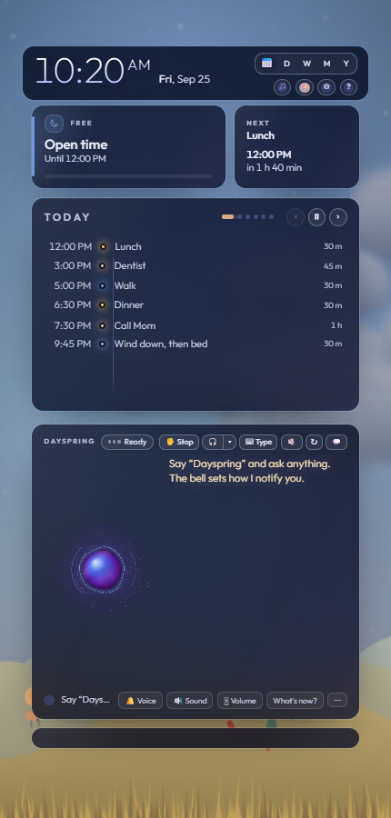
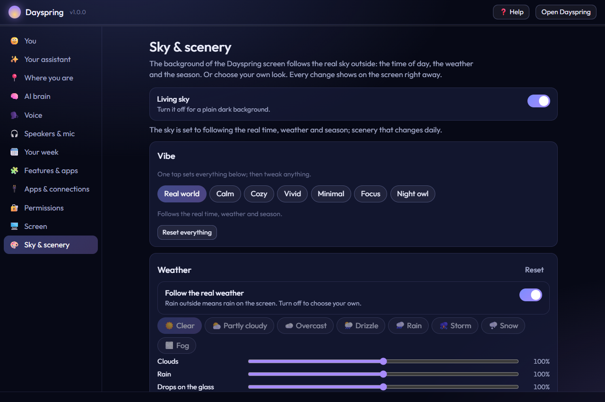

# Display setup

Dayspring's screen can go on any screen: a TV, a spare monitor, a small tablet-style display, or your laptop's own screen. It works best on a screen of its own, always on, where you can glance at it.

## Option A: a second screen (recommended)

1. Connect the screen to your computer with HDMI, DisplayPort or USB-C.
2. Press **Win+P** and choose **Extend**. This gives the screen its own desktop, rather than a copy of your main screen.
3. Optional: open **Settings → System → Display**, click **Identify** to see which number each screen is, and drag the boxes so they match where the screens sit.
4. In Dayspring, open Settings → **Screen** and choose **Automatic** or **Second screen**.
5. Start Dayspring. The screen opens full screen on the second display.

For a TV or an always-on display, turn on Settings → **Screen** → **Keep the Dayspring screen open**: then if the screen closes, or you unplug and re-plug the display, it comes back within about a minute. It's off unless you turn it on, so when you close Dayspring it stays closed.

## Option B: just your main screen

1. Open Settings → **Screen** and choose **Main screen**.
2. Start Dayspring. The screen opens full screen on your main display.
3. Press **Alt+Tab** to switch between Dayspring and your other windows.

> **Tip:** On a single screen, you might prefer **Dayspring mini** (below), or the **desk view** at `http://localhost:4747`: a normal window with your day and a chat panel.

## Opening Dayspring: app window, compact, full screen or browser tab

It's the same Dayspring every way: the same screen, voice, schedule and settings. Only the window around it changes. Choose in Settings → **Screen** → **How Dayspring opens** (or in the guided setup):

| | What you see | Good for |
|---|---|---|
| **Automatic** (the usual) | An app window on your main screen; full screen on a TV or second screen. | Most people. |
| **App window** | A clean window of its own, with no address bar or tabs, and its own taskbar icon. It remembers the microphone and your sign-ins. | Using your computer while Dayspring is open. |
| **Compact (Dayspring mini)** | A small window: the time and date, what's on now and next, the weather, the orb, a chat box and the voice buttons. | A corner of your desktop. |
| **Full screen** | Fills the screen, like the TV view. Move the mouse to the top for the window buttons. | A TV or a screen of its own. |
| **Browser tab** | A normal tab in your browser, next to your other tabs. | Trying it out, or a browser you like to keep everything in. |

**What's the difference between the browser tab and the app window?** Nothing inside: it's the same page. The app window has no browser bars, its own icon on the taskbar, its own Dayspring profile (so the microphone is allowed once and stays allowed) and it can't be closed by accident along with your other tabs. In a browser tab the browser may ask for the microphone, and sound may need one click on the page before it can start.

**Just once, a different way:** the Start menu has **Dayspring (full screen)**, **Dayspring mini** and **Dayspring in browser**. Or say:

- "open Dayspring in my browser" (a tab)
- "open in its own window" (the app window)
- "go full screen" / "full screen"
- "make Dayspring small" / "compact mode" (Dayspring mini)

The **Dayspring** icon on your desktop always opens the app window (or the way you chose), never a tab.

### Dayspring mini (compact mode)

Dayspring mini is the same Dayspring window made small. It picks its layout from its size: make any Dayspring window small and it becomes the mini view; make it big and the full screen comes back.

- **⤡ Compact**: next to the talk buttons, or in the window bar at the top of the full view (move the pointer there). The same window shrinks to about 380 × 560 at the top-right of the screen.
- **⤢ Expand**: in the mini view. The same window fills the screen again with the full view. Maximizing it does the same.
- **Keep on top**: click the coloured badge (**Active**, **Quiet** or **Off**) in the mini view and tick **Keep on top** to keep it above your other windows.
- Move and resize it however you like. Dayspring remembers where it was and whether you last used it compact, and opens that way next time.

The mini view shows the time and date, what's on now and next, the weather, the orb, a chat box, the Active / Quiet / Off badge, and the voice buttons: 🎙 **Talk** (listen now), ✋ **Stop** and 🎤 (stop listening).

## Choosing the browser

Settings → **Screen** → **Which browser shows Dayspring?** lists every browser on your computer. The choice is used for every way Dayspring opens (app window, mini, full screen, browser tab) and for ↗ **Pop out**. After changing it, press **Reopen now in …** to switch without restarting. You can also say "use Brave for Dayspring" (or Edge, Chrome, Firefox…).

Each browser keeps its own Dayspring sign-ins, so after switching, allow the microphone once and sign in to Spotify and your other apps again in the new browser.

### Using Dayspring with Brave

Brave works fully:

- **Listening**: Brave doesn't include the speech recognition that Chrome and Edge have, so Dayspring uses its own private recognizer, which runs on your computer (nothing you say leaves the PC). The first time, Dayspring offers a one-time download of about 200 MB. You can choose this for any browser in Settings → **Screen** → **Speech recognition** → **On this computer (private)**.
- **Voices**: Dayspring's voice uses the Windows voices (or ElevenLabs and the other voice services, if you set one up). Edge's "Natural" voices are only in Edge.
- **Shields**: if music, a video or a sign-in doesn't work in the Dayspring window, click the lion icon in the address bar of a normal Brave window on `localhost` and turn **Shields** down for it. Dayspring shows this tip when something is blocked.
- **Sound**: Dayspring's window is allowed to play sound by itself. In a Brave tab, click the page once if it asks.

## Which screen number is which?

If you have three or more screens, choose **A specific screen** and enter its number. Screen numbers match **Settings → System → Display → Identify**.

## The picture is cut off at the edges (overscan)

Many TVs zoom the picture slightly, cutting off the edges. Fix it either way:

- **In Dayspring**: use **📐 Fit to screen** (below), or say "the screen is cut off" (each time pulls everything in a little), "the top is cut off" (just that edge), "use more of the screen" (pushes it back out), or "reset the screen size". Or use the **Margins** sliders in Settings → **Screen**.
- **On the TV** (best): in the TV's picture settings, look for **Just Scan**, **Screen Fit**, **Full Pixel**, **1:1** or **Aspect ratio → Original**. Turn off **Overscan**.

## Fitting Dayspring to your screen

Every screen is different: a TV that crops its edges, a small monitor, a huge one across the room. **Settings → Screen** has everything you need to get the size right and every part fully on screen. Every control changes the Dayspring screen **right away**, so adjust it while you watch. Each group has its own **Reset**, and **Reset the whole screen layout** puts everything back (your all-sides margin stays).

### 📐 Fit to screen (the quickest way)

1. Open it: move the pointer to the top of the Dayspring screen and click **📐** in the bar, or press **📐 Fit to screen…** in Settings → Screen, or say **"fit to screen"**.
2. You'll see a **bright green line** around the edge, with **pink** showing what your TV may cut off, and a label on each edge (Top, Bottom, Left, Right).
3. Move each line until it's **just visible**:
   - click **−** / **+** next to each edge (or **All edges**), or
   - **drag** the green line, or
   - press **T**, **B**, **L** or **R** to pick an edge and the **arrow keys** to move it (**Shift** moves it further; **+** / **−** move all four).
4. Not sure where to start? Press **Auto-fit**: the margins go to 0 so you can see which edges your TV hides, then pick the smallest **Common TV margin** (0 %, 2.5 %, 5 %, 7.5 %, 10 %) that shows all four lines.
5. Press **Save** (or Enter). **Cancel** (or Esc) puts it back the way it was.

### Size

| Control | What it does |
|---|---|
| **Everything** (60–150 %) | The whole screen bigger or smaller: text, buttons, spacing. |
| **Text in the cards** (80–130 %) | Just what's inside the cards. |
| **The clock** (60–160 %) | The big clock. |

### Margins

| Control | What it does |
|---|---|
| **All sides** (0–20 %) | How far everything stays in from every edge. |
| **Top / Bottom / Left / Right** | One edge on its own, for a TV that crops unevenly. Moving **All sides** again resets them to match. |

### Layout

| Control | Choices |
|---|---|
| **Arrangement** | **Automatic** (follows the screen's shape), **Two columns**, **Dayspring panel on the right**, **Dayspring panel on the left**, **One column**, **Compact**. |
| **Dayspring panel width** | 25–50 % of the width, or **Automatic**. |
| **Spacing** | **Comfortable** or **Compact** (tighter gaps and padding). |
| **Shape** | **Fill the screen**, or **Keep proportions** (a 16:9 layout centered on a very wide or odd-shaped screen). |

### What to show

Turn each part on or off: **the clock and date**, **Now and Next**, **the rotating panel**, **the exam countdown**, **the course rings**, and **the transcript** (what you and Dayspring said). **Rows in the day list** limits how many schedule items the day list shows (0 = as many as fit).

### Motion

**Seconds per slide** sets how long the rotating panel stays on each slide (0 = it stays put). **Calmer motion** turns off most animations. (The sky has its own motion setting in 🎨 **Sky & scenery**.)

### By voice (no AI needed)

- "make everything bigger" / "make everything smaller"
- "bigger text" / "smaller text", "bigger clock"
- "the top is cut off", "the bottom is cut off", "the left side is cut off"
- "move everything down / up / left / right / in"
- "make the talk panel wider", "put the Dayspring panel on the left", "one column", "two columns", "compact layout"
- "hide the exam card", "show the exam card", "hide the course rings", "hide the transcript"
- "show 5 rows on the schedule", "stop rotating the panel", "rotate the panel again"
- "keep the proportions", "fit to screen", "reset the screen layout"

However you set it, Dayspring still fits everything inside: long text shortens, extra buttons tuck into **⋯** menus, and small cards fold away before anything spills off the screen.

### Text still too small or too big?

You can also change Windows' own scale: **Settings → System → Display**, select the Dayspring screen and change **Scale** (for example 100 % → 150 %).

## Any window size, any margin

Dayspring rearranges itself to fit whatever window it's in (a TV, a monitor, half of your laptop screen, a tall portrait screen) and whatever margin you set with the **Overscan** slider. Everything is sized from the space *inside* the margins, so moving the slider reflows the content instead of squeezing it out of its boxes.

When space gets tight, in this order:

1. Long text uses a shorter version: "Friday, September 25" → "Fri, Sep 25" → "Sep 25"; "9:30 AM – 10:00 AM" → "9:30–10 AM"; the exam's place shortens. Hover a shortened title to see all of it.
2. Buttons drop their words and keep their icons (hover for the name).
3. Buttons you use less move into a **⋯** menu at the end of their row. Click **⋯** (or Tab to it and press Enter) to reach them; Esc closes it.
4. The small cards (the exam countdown, course rings, the music card) go compact, and if a column still runs out of room they fold away. They come back by themselves when there's space again.

Wide screens keep the two columns. On a square or tall screen the Dayspring panel moves under your day, with the small cards beside it; on a very tall, narrow screen everything stacks in one column.

## The window bar: minimize, maximize, hide, close

Move the pointer to the **top** of the Dayspring screen (anywhere above the clock) and a thin bar appears just above your content (it hides again a moment after the pointer leaves; pressing Tab also reveals it). From left to right:

| Button | What it does |
|---|---|
| 🔊 | Opens the **Sound** panel (speakers, microphone, every volume). |
| ⬆ | Shows up only when a new version is ready: opens **What's new** with **Update now**. |
| ⤡ / ⤢ | **Compact** (Dayspring mini) / **Expand** back to the full view. See "Dayspring mini". |
| 📐 | **Fit to screen**: line up the edges and save (see "Fitting Dayspring to your screen"). |
| ⛶ | Full screen on and off. **F11** does the same. |
| — | Minimize to the taskbar. |
| □ / ❐ | Maximize to fill the screen it's on / restore it to its old size. |
| 👁 | Hide: the window disappears (even from the taskbar) but **keeps running**, so voice, alarms and reminders still work. |
| ✕ | Close the Dayspring screen. It asks first, because **alarms and reminders play from this screen** and won't sound until it's open again. |

**Bringing it back** after hiding or closing:

- Say **"Dayspring, show yourself"** (works while it's hidden), or type "open the screen" on the desk page.
- Open **Start Dayspring** (or Start Dayspring TV). If the screen is only hidden or minimized, that brings the same window back instead of opening a second one.

After you close it with ✕, Dayspring doesn't reopen it by itself; it waits until you ask.

**By voice** (no AI needed): "full screen", "exit full screen", "minimize", "maximize", "restore the window", "hide the screen" / "hide yourself", "show yourself", "close the screen".

These controls only ever touch Dayspring's own window, never your other browser windows or apps.

## Windows on the screen: big, small, minimised

The windows that open **on** the Dayspring screen (the Music & Video browser, the file viewer, Maps, Mail, GIFs, the picture grid, the Schedule, and pages like Settings, Cameras, Printers and Devices) can each be:

- **Big:** fills the screen, inside its margins.
- **Normal:** its usual size.
- **Small:** a window you drag anywhere by its title bar. It snaps to an edge or corner when you let go within 24 pixels of it, resizes from the dotted handle on its inner corner, and always stays inside the screen's margins. Dragging a normal or big window by its title bar makes it small.
- **Minimised:** it tucks into the **dock**, a row of chips along the bottom of the screen (left of the player card, never over it). Click a chip to bring the window back the way it was; its ✕ closes it.
- **Closed.**

Each window has the same three buttons on its title bar: **–** minimise, **❐** small window (again: normal), **▢** big (again: normal). Double-click a title bar to switch between big and normal. Where you put a small window, and how big it was, is remembered for each window and each screen size, and a window opens the way you last had it.

A video works the same way, with **audio only** as its "minimised": see [Videos](videos.md#big-in-the-corner-or-just-the-sound).

**Keys:** with a window selected, **Alt+↑** big (again: normal), **Alt+↓** minimise, **Alt+S** small (again: normal). With a small window itself selected, the arrow keys move it and **Shift**+arrows resize it. **Alt+Shift+↓** minimises everything; **Alt+Shift+↑** brings it all back.

**By voice** (no AI needed): "minimize the map", "shrink the email", "put the viewer in the corner", "maximize the browser", "make the map bigger", "restore the map", "move the map to the right side", "close the viewer", "hide everything" (or "minimize all"), "show everything again". A window is found by its name: the map, the email, the viewer (or the file), the browser (or the music browser), the GIFs, the pictures, the schedule, the settings, the cameras, the printers, the devices.

Add-ons can use the same window manager: `winman.register("gallery", element, { title: "Photos", icon: "🖼", aliases: ["gallery", "photos"], bar: ".header", onClose, isOpen })`.

## Night mode

After your last scheduled item, Dayspring's screen goes nearly black, with a faint drifting clock so nothing burns in. It wakes up for reminders or when you talk to it.

- "Night mode dim": dims instead of going dark
- "Turn off night mode": stays fully bright

## The living sky

The background of the Dayspring screen is a living sky. It follows the real world where you live (your location is set in Settings → **Where you are**):

- **Time of day**: starry night with the moon in its real phase, then rosy pinks and peach before sunrise, a glowing sunrise, bright blue by midday, golden hour, orange and magenta at sunset, and violet dusk.
- **Weather**: clouds lit by the sun (pink at sunrise, gold at sunset), grey skies when it's overcast, rain with drops beading on the glass, a soft lightning flash in storms, snow, and fog. The real wind moves the clouds, slants the rain and sways the grass.
- **Season**: blossoms and petals in spring, deep green in summer, fall colors and leaves blowing past, snow and bare trees in winter.
- **Scenery** along the bottom, lit by the same sky: rolling hills, crop fields, a forest, or a river that reflects the sky (it freezes in deep winter, and rain makes ripples). A different scene each day, unless you choose one.

The whole screen follows along. Buttons and highlights turn rosy at dawn, sky blue by day and amber at dusk. The cards get darker glass when the sky is bright, so text always stays easy to read.

### Controls

Open **Settings → Sky & scenery**, or tap **🎨 Sky** by the clock. Every change shows on the screen right away.

| Group | What you can set |
|---|---|
| **Living sky** | On or off (off = the plain dark background) |
| **Vibe** | One-tap presets (below), then tweak anything. **Reset everything** goes back to the real world. |
| **Weather** | Follow the real weather, or choose one (clear, partly cloudy, overcast, drizzle, rain, storm, snow, fog). Amounts for clouds, rain, drops on the glass, snow, fog, wind strength and sun rays & glimmer, plus lightning on or off. |
| **Time of day** | Follow the sun, or lock it to a time (night, sunrise, midday, golden hour, sunset…). Shift sunrise/sunset by up to an hour. |
| **Season** | Follow the calendar, or choose one. How many leaves, petals and seeds drift by. |
| **Scenery** | A new scene each day, or hills / fields / forest / river / none. Grass in the front, water shimmer, night lights & fireflies, stars & moon. |
| **Colors** | Brightness, color richness, warmth (cool ↔ warm), darkening behind the cards, and whether accent colors follow the sky. |
| **Motion** | Normal, reduced (no particles), or still (a paused painting, redrawn once a minute). Smoothness: 15, 30 or 60 frames per second (30 is plenty). |
| **Schedule-aware vibe** | Optional. Change the vibe during blocks of a category, for example Focus while studying and Calm during devotions. It goes back when the block ends. |
| **Preview** | Shows a look for 20 seconds without saving it. |

Every group has its own **Reset** button.

### Vibes

| Vibe | What it does |
|---|---|
| **Real world** | Follows the real time, weather and season (the default) |
| **Calm** | Fewer particles, slower wind, softer colors |
| **Cozy** | Warm tones, a gentle drizzle, fireflies at night |
| **Vivid** | Richer color and more motion |
| **Minimal** | Just the sky's colors: no particles, no scenery |
| **Focus** | Dim and still, for studying |
| **Night owl** | Always the night sky |

### Things you can say

These work without an AI brain:

- "make it rain" / "make it snow" / "make it sunny" / "go back to the real weather"
- "turn off the rain" / "turn off the lightning" / "turn off the fireflies" / "turn on the snow"
- "less wind" / "more wind" / "more leaves" / "fewer particles"
- "switch to cozy mode" / "calm vibe" / "focus mode" / "minimal mode" / "night owl mode"
- "use the forest scene" / "switch to the river scene" / "turn off the scenery" / "rotate the scenery"
- "night sky" / "make it a sunset sky" / "follow the sun"
- "make it look like winter" / "fall scenery"
- "brighter background" / "dimmer background" / "warmer colors" / "cooler colors"
- "freeze the sky" / "animate the sky again" / "turn off the living sky"
- "show me the sunrise look" / "preview rain" / "preview the forest scene" (20 seconds, nothing saved)
- "put the sky back to normal" / "back to the real world"
- "what's the sky set to?"

With an AI brain, describe anything: "make it look like a cozy autumn evening by a river", "a sunny spring meadow, but keep it calm", "warmer colors and more leaves". Dayspring sets the controls and tells you what it did. Changes you make by voice show up in Settings, and the other way around.

> **If it doesn't work:**
> - **The sky shows the wrong time of day**: set your location in Settings → **Where you are**. Without one, Dayspring guesses from your time zone.
> - **The weather doesn't match outside**: the weather updates about every 12 minutes. If you picked a weather in Settings (or said "make it rain"), say "go back to the real weather".
> - **It's too busy while I work**: choose **Calm**, **Minimal** or **Focus**, or set Motion to **Reduced** or **Still**.
> - **The computer feels slow**: set Smoothness to **15 fps** or Motion to **Still**. Your system's "reduce motion" setting is respected automatically.

## Keeping the screen awake

Dayspring keeps your computer awake by itself while it's running on the Dayspring screen **and the computer is plugged in**. There's no sleep, the screen stays on, and the idle lock screen doesn't kick in, so it can wake you, remind you and hear you. It's on by default.

- **On battery**, the computer sleeps as usual.
- **Nothing in your Windows power settings changes.** When Dayspring stops, everything goes back to normal on its own.
- **Turn it off or on** in Settings → **Screen** → **Stay awake**, or just say *"let the computer sleep"* / *"keep the laptop awake"* (no AI needed).
- **A screen saver can still lock the screen.** If yours is set to lock, turn that off: open Windows **Settings → Personalization → Lock screen → Screen saver** and untick **On resume, display logon screen** (or set the screen saver to **(None)**).

Prefer to do it by hand instead? Open Windows **Settings → System → Power & battery → Screen and sleep** and set the "when plugged in" times to **Never**.

> **If it doesn't work:**
> - **It opened on the wrong screen**: choose the screen explicitly in Settings → **Screen** (Main, Second, or a number), then restart Dayspring.
> - **"No second display found"**: press **Win+P** → **Extend**, and check the screen is on and on the right input (HDMI 1/2…).
> - **The screen is black but the clock drifts**: that's night mode. Say "Dayspring" or move the mouse.
> - **Chrome asks to restore pages**: close that bar. Dayspring uses its own browser profile, so this is rare.
