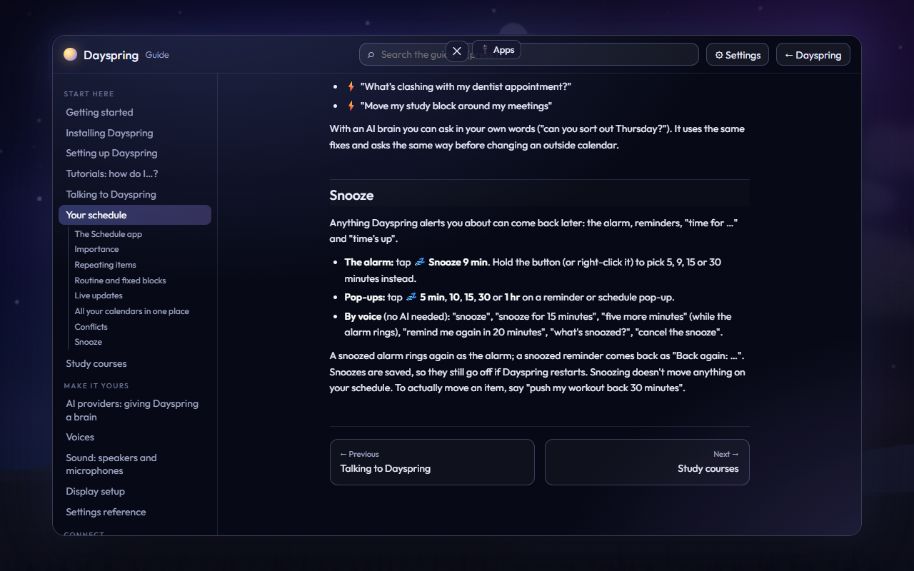

# Tutorials: how do I…?

Every task in Dayspring, with a link to its step-by-step walkthrough. You can also just ask Dayspring: "how do I snooze?", "how do I connect Spotify?". It opens the right page on the screen and reads you the first steps.

## Install, update, remove

- **Install Dayspring** → [Installing](install.md#step-1-get-dayspring): download the ZIP from Releases, unzip, **Install Dayspring.cmd**, then **Start Dayspring.cmd**.
- **Go through the first-time setup** → [The guided setup](setup-wizard.md)
- **Start the setup over** → open `http://localhost:4747/welcome` and press **Start over** ([The guided setup](setup-wizard.md))
- **Update Dayspring** → [Updating](updating.md)
- **Choose when updates install** → [Updating](updating.md#choose-what-happens-every-time)
- **Check for and install updates** → [Updating](updating.md#check-for-updates-yourself)
- **Go back to the previous version** → [Updating](updating.md#going-back-to-the-previous-version-by-hand)
- **Move Dayspring to a new computer** → [Installing](install.md#moving-to-a-new-computer)
- **Uninstall** → [Installing](install.md#uninstalling-dayspring)
- **Open Dayspring in a browser tab, its own window, full screen or small** → [Display setup](display-setup.md#opening-dayspring-app-window-compact-full-screen-or-browser-tab)
- **Make Dayspring quiet or turn it off** → [Quiet mode and notifications](quiet-and-notifications.md#active-quiet-or-off)
- **Find Dayspring in Task Manager** → [Troubleshooting](troubleshooting.md#whats-running)
- **Erase all my data** → [Privacy](privacy.md#erasing-everything)

## Talk to it

- **Wake it up and ask something** → [Talking to Dayspring](talking-to-dayspring.md#the-basics)
- **Use the buttons on the talk panel (Stop, Type, Text only)** → [Talking to Dayspring](talking-to-dayspring.md#the-buttons-on-the-talk-panel)
- **Change its name or wake word** → [Settings reference](settings-reference.md#your-assistant)
- **Change how it talks to me (humor, nicknames)** → [Talking to Dayspring](talking-to-dayspring.md#how-it-talks-to-you)
- **Ask about something that was on the screen** → [Talking to Dayspring](talking-to-dayspring.md#ask-about-whats-on-the-screen)
- **Change settings by voice** → [Talking to Dayspring](talking-to-dayspring.md#settings-commands)
- **Make lists, do research and see results** → [Talking to Dayspring](talking-to-dayspring.md#lists-research-and-results)

## AI and voices

- **Connect Claude** → [AI providers](ai-providers.md#claude-anthropic)
- **Connect ChatGPT** → [AI providers](ai-providers.md#chatgpt-openai)
- **Connect Grok** → [AI providers](ai-providers.md#grok-xai)
- **Use a free AI on my own computer (Ollama)** → [AI providers](ai-providers.md#ollama-free-on-your-computer)
- **Let the AI look things up online** → [AI providers](ai-providers.md#looking-things-up-online)
- **Switch AI or turn it off** → [AI providers](ai-providers.md#switching-or-turning-it-off)
- **Change its voice** → [Voices](voices.md)
- **Pick a free voice** → [Voices](voices.md#free-voices)
- **Get the free Natural voices (Edge)** → [Voices](voices.md#free-voices) and [Installing](install.md#step-4-optional-choose-the-browser)
- **Set up ElevenLabs voices** → [Voices](voices.md#elevenlabs-the-most-natural)
- **Add more ElevenLabs voices** → [Voices](voices.md#getting-more-voices-from-the-voice-library)
- **Use OpenAI voices** → [Voices](voices.md#openai-voices)

## Sound

- **Choose my speakers** → [Sound](audio-devices.md#choose-where-daysprings-voice-plays)
- **Choose which speakers it talks through** → [Sound](audio-devices.md#choose-where-daysprings-voice-plays)
- **Choose its microphone** → [Sound](audio-devices.md#choose-the-microphone)
- **Name my devices ("my blue headset")** → [Sound](audio-devices.md#nicknames)
- **Change the voice, music and effects volume** → [Sound](audio-devices.md#the-sound-panel)
- **Play music on several speakers at once (Voicemeeter)** → [Sound](audio-devices.md#music-on-several-speakers-at-once-optional-advanced)

## The screen

- **Put Dayspring on a TV or second monitor** → [Display setup](display-setup.md#option-a-a-second-screen-recommended)
- **Use just my main screen** → [Display setup](display-setup.md#option-b-just-your-main-screen)
- **Fix a picture that's cut off at the edges** → [Display setup](display-setup.md#the-picture-is-cut-off-at-the-edges-overscan)
- **Fit it to my screen, size, margins and layout** → [Display setup](display-setup.md#fitting-dayspring-to-your-screen)
- **Choose what shows on the screen** → [Display setup](display-setup.md#what-to-show)
- **Minimize, maximize, hide or close the screen** → [Display setup](display-setup.md#the-window-bar-minimize-maximize-hide-close)
- **Use night mode** → [Display setup](display-setup.md#night-mode)
- **Change the background** → [Display setup](display-setup.md#the-living-sky)
- **Change the living sky, weather and scenery** → [Display setup](display-setup.md#the-living-sky)
- **Pick a vibe (Cozy, Focus, Night owl…)** → [Display setup](display-setup.md#vibes)
- **Keep the computer awake** → [Display setup](display-setup.md#keeping-the-screen-awake)

## Your schedule

- **Open the Schedule app and switch views** → [Your schedule](schedule.md#the-schedule-app)
- **Add an item** → [Your schedule](schedule.md#adding)
- **Edit, drag or delete an item** → [Your schedule](schedule.md#editing-and-deleting)
- **Mark how important something is** → [Your schedule](schedule.md#importance)
- **Make something repeat** → [Your schedule](schedule.md#repeating-items)
- **Set up my regular week and things that never move** → [Your schedule](schedule.md#routine-and-fixed-blocks)
- **Snooze the alarm or a reminder** → [Your schedule](schedule.md#snooze)
- **Set reminders** → [Talking to Dayspring](talking-to-dayspring.md#reminders)
- **Add birthdays and special days** → [Talking to Dayspring](talking-to-dayspring.md#people-birthdays-and-special-days)
- **Show my Google or Outlook calendar** → [Connecting apps](connections.md#google-calendar--gmail)
- **Add a school, team, iCloud or holiday calendar** → [Connecting apps](connections.md#calendar-subscriptions-icloud-school-teams-holidays)

## Music and videos

- **Turn on music** → [Music and videos](music.md#turn-it-on)
- **Set up Spotify inside Dayspring** → [Music and videos](music.md#spotify-inside-dayspring-recommended)
- **Use the music card** → [Music and videos](music.md#the-music-card)
- **Watch videos** → [Music and videos](music.md#watching-videos)
- **Make video playlists** → [Music and videos](music.md#video-playlists)
- **Get YouTube without ads** → [Music and videos](music.md#sign-in-to-youtube-for-no-ads)
- **Listen together with friends** → [Music and videos](music.md#party--jam-listening-together)
- **Wake up to music** → [Music and videos](music.md#morning-music)
- **Hear my music and video stats** → [Talking to Dayspring](talking-to-dayspring.md#your-music-and-video-stats)

## Documents, files, programs and the web

- **Have it read a document aloud** → [Documents](documents.md#reading-aloud)
- **Get a summary or explanation** → [Documents](documents.md#summaries-and-explanations)
- **Let it use my files** → [Files and browser](files-and-browser.md#allow-it) and [Permissions](permissions.md#files-and-folders)
- **Control whether it may change files** → [Permissions](permissions.md#changing-files)
- **Let it open programs** → [Permissions](permissions.md#programs)
- **Let it use websites for me** → [Files and browser](files-and-browser.md#using-websites-for-you-browser-control)
- **Open links in my normal browser** → [Files and browser](files-and-browser.md#opening-links-in-your-normal-browser)

## Discover (things you're into)

- **Add or remove interests** → [Discover](discover.md#your-interests)
- **See what it found** → [Discover](discover.md#on-the-screen)
- **Change how often it looks** → [Discover](discover.md#settings)

## Calls, Discord and your phone

- **Let it hear and answer in Discord or Teams calls (Tune in)** → [Tune in to calls](discord-calls.md#turn-it-on-and-off)
- **Choose which sound it listens to in calls** → [Tune in to calls](discord-calls.md#which-sound-it-listens-to)
- **Set up the Dayspring Discord bot** → [Discord bot](discord-bot.md#set-it-up-about-5-minutes)
- **Have my texts read aloud** → [Your phone](phone.md#turn-it-on-in-dayspring)
- **Hear my texts (iPhone)** → [Your phone](phone.md#iphone)
- **Hear my texts (Android)** → [Your phone](phone.md#android)

## Connecting apps

- **Connect Notion** → [Connecting apps](connections.md#notion)
- **Connect Google Calendar and Gmail** → [Connecting apps](connections.md#google-calendar--gmail)
- **Connect Outlook and Microsoft To Do** → [Connecting apps](connections.md#outlook--microsoft-to-do)
- **Get news and RSS feeds** → [Connecting apps](connections.md#news-and-rss-feeds)
- **Control my smart home (Home Assistant)** → [Connecting apps](connections.md#home-assistant-smart-home)
- **Connect IFTTT, Zapier, Make or n8n (webhooks)** → [Connecting apps](connections.md#webhooks-ifttt-zapier-make-n8n)
- **Connect Todoist** → [Connecting apps](connections.md#todoist)
- **Get severe weather alerts** → [Connecting apps](connections.md#severe-weather-alerts)
- **Show my photos** → [Photos](photos.md#turn-it-on)

## Study and faith

- **Study a course with it** → [Studying](learning.md#things-you-can-say)
- **Use the study window** → [Studying](learning.md#the-study-window)
- **Add my own course** → [Studying](learning.md#adding-your-own-course)
- **Morning quiet time** → [Faith features](faith-features.md#morning-quiet-time)
- **Keep a prayer list** → [Faith features](faith-features.md#prayer-list)
- **Memorize Scripture** → [Faith features](faith-features.md#memory-verses)
- **Choose a Bible version** → [Faith features](faith-features.md#bible-versions)
- **Church times, sermon notes and the bulletin** → [Faith features](faith-features.md#church)

## For tinkerers

- **Let Dayspring change its own code (Claude Code)** → [Claude Code](claude-code.md)
- **Undo a change it made to itself** → [Claude Code](claude-code.md#undoing-a-change)
- **How Dayspring is built** → [Architecture](dev/architecture.md)
- **Add a voice command, tool or connector** → [Extending Dayspring](dev/extending.md)

## When something's wrong

- **It won't start** → [Troubleshooting](troubleshooting.md#it-wont-start)
- **It doesn't hear me** → [Troubleshooting](troubleshooting.md#it-doesnt-hear-me)
- **No sound** → [Troubleshooting](troubleshooting.md#no-sound)
- **Other apps lost their sound or mic** → [Troubleshooting](troubleshooting.md#other-apps-lost-their-sound-or-mic-discord-teams)
- **It's stuck on "thinking"** → [Troubleshooting](troubleshooting.md#its-stuck-on-thinking)
- **Everything else** → [Troubleshooting](troubleshooting.md) and the [FAQ](faq.md)
