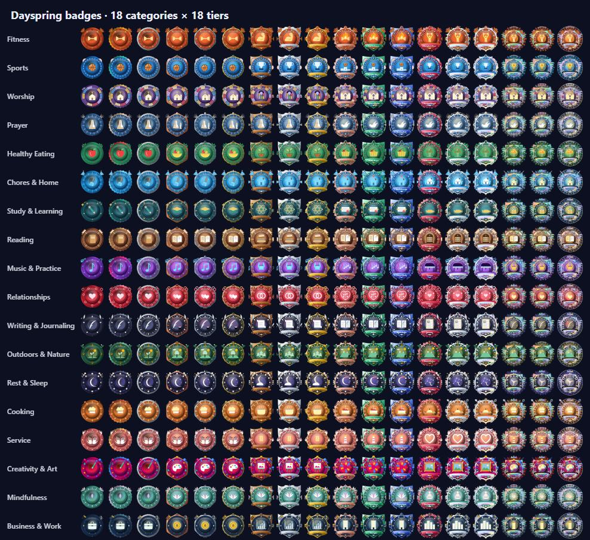

# XP and badges: earning it for real

Dayspring gives you **XP** when you check in on things you actually did: a workout, a study session, a chore, a phone call to someone you love, a lesson in Lantern. XP is private (it stays on this computer). It unlocks the **secret characters** in Settings → Personality, it raises your **level**, and over the years it fills a wall of **badges**: 18 in each of 18 kinds of good habit. It's built to be earned, not farmed.

## How to earn XP

**Check in when you finish something.** Say or type it the way you'd tell a friend:

- "I finished my workout" · "I went for a run" · "I played basketball"
- "I studied for an hour" · "I read a chapter"
- "I did the dishes" · "I cooked dinner" · "I ate a salad for lunch"
- "I prayed this morning" · "I went to church"
- "I called Mom" · "I volunteered at the food bank"
- "I practised piano" · "I wrote in my journal" · "I painted a sunset"
- "I went for a walk" · "I meditated for 10 minutes" · "I went to bed on time"

Dayspring also asks you when a **scheduled block ends**: "Did you finish your workout? You can say yes, partly, or no." And when a **Dayspring focus timer or pomodoro** finishes, it asks "Did you finish your focus session?" and counts the time in full. Answer out loud or type it. It never asks while it's Off or Quiet, during a call, while an alarm rings, or when you've said "stop listening" on the screen that speaks.

A spoken question waits about **12 seconds** for your answer. If it doesn't understand, it asks once more, then lets it go ("No problem, you can tell me later."). If you say something else entirely ("set a timer for 10 minutes", "what's the weather?"), Dayspring does that instead and forgets the check-in. A check-in you type on the **Progress** page waits 3 minutes.

It then asks one quick question so it counts:

| Task | Dayspring asks |
|---|---|
| Workout, sports | What did you do (or play), and for about how long? |
| Study | What's one thing you learned? (then, with AI, one follow-up question about it) |
| Reading | What did you read, and what's one thing that stuck with you? |
| Work / focus | About how long did you work? (it asks again if you don't say how long) |
| Chore, cooking, healthy meal, writing, practice, outdoors, art, service, mindfulness | Which one? / What did you make, eat, help with? (a few words: "washed the dishes") |
| Calling someone | Who did you talk to? ("nobody" doesn't count) |
| Prayer | Nothing to prove. It just asks gently if you'd like to add anything to your prayer list; only something you ask it to add ("add my mom", "pray for Sam", "yes, for my aunt") goes on the list. |
| Worship, bed on time | Nothing to prove. |

**Every answer needs a few real words.** "lol", "asdf" or a single word doesn't count; it asks once more, then lets it go. **Studying and reading need a real answer.** "I learned stuff" doesn't count. Tell it one specific thing, in a sentence or two: "I learned that the preterite is for finished actions and the imperfect is for ongoing ones." With an AI key, Dayspring asks one follow-up question about what you said, and a genuine answer earns the full amount. Prayer and worship are never quizzed.

## What things are worth

| Task | XP | Up to |
|---|---|---|
| Study | 25 (+10 for a great takeaway) | 2 a day |
| Workout | 20 | 2 a day |
| Sports | 20 | 1 a day |
| Service / volunteering | 20 | 1 a day |
| Reading | 15 (+5 for a great takeaway) | 2 a day |
| Practice (music, a skill) | 15 | 2 a day |
| Worship / church | 15 | 1 a day |
| Work / focus | 15 an hour, up to 3 hours | 2 a day |
| Calling or visiting someone | 12 | 1 a day |
| Outdoors / a walk | 12 | 1 a day |
| Art / making | 12 | 2 a day |
| Prayer / devotional | 10 | 2 a day |
| Writing | 10 | 2 a day |
| Cooking a meal | 10 | 2 a day |
| Bed on time | 10 | 1 a day |
| A chore | 8 | 3 a day |
| A healthy meal | 8 | 2 a day |
| Mindfulness | 8 | 2 a day |
| **Learning in Lantern** | lesson 12 · exercise 5 · practice 8 · unit check up to 40 · project milestone 25 · unit 60 · course 300 | see [Learning in Lantern](#learning-in-lantern) |

**The rules that keep it fair:**

- **80 XP a day at most** from check-ins, however much you do.
- **Did it partly?** Say so ("about half"), and it counts in part (at least a quarter).
- **Check-ins you start yourself count 70%.** Put the task on your schedule and check in when the block ends (once per block), or finish a Dayspring focus timer or pomodoro, and it counts in full. Only Dayspring itself can give that full credit: a check-in typed on the Progress page is always your own.
- The same kind of task can be checked in again only after **2 hours**.
- **Today or yesterday only.** No catching up on last week.
- The same "what I learned" answer can't count twice (a new answer to the follow-up question doesn't make it new). Refusals and jokes earn nothing.
- Changed your mind? Say **"undo my last check-in"** within 10 minutes. It undoes your own check-ins only (not Lantern's learning), and not if you've already spent that XP on an unlock.
- **If your computer's clock is set back**, XP pauses ("Your computer's clock changed; XP paused until it's fixed.") until the clock is right again.
- **At most 80 XP a day can be added to what you spend**, from check-ins and learning together. On a big study day the rest still counts toward your level, your badges and your lifetime total.

## Levels and streaks

- Every **300 XP** you earn is a new level: Novice, Apprentice, Journeyman, Adept, Expert, Master, and beyond. Levels are just for fun; spending XP never lowers them.
- Your **streak** counts the days in a row you checked in on something real. From day 7 you get **+10%** (still within the 80 a day). Miss one day a month and your streak is saved.

## What XP unlocks

**Secret characters.** First you *find* one (say or do the right thing; the gallery gives riddles), then you *unlock* it with XP:

- The first costs **500 XP**, which is at least a week of real effort even on your best days (the 80-a-day spending limit makes sure of it, learning included).
- Each one after that costs **50 more** (550, 600…).

Say "what can I unlock?" or open **Progress** (the XP badge in the corner of the Dayspring screen).

## Badges

Every kind of check-in fills its own badge category. Each category has **18 badges**, from a first step to a legend, meant to be collected over **3–5 years** of real habits.

| Badge category | Check-ins that count |
|---|---|
| Fitness | workouts |
| Sports | sports |
| Worship | worship / church |
| Prayer | prayer / devotionals |
| Healthy Eating | healthy meals |
| Chores & Home | chores |
| Study & Learning | study check-ins **and learning in Lantern** |
| Reading | reading |
| Music & Practice | practice |
| Relationships | calling or visiting someone |
| Writing & Journaling | writing |
| Outdoors & Nature | outdoors / walks |
| Rest & Sleep | bed on time |
| Cooking | cooking |
| Service | volunteering |
| Creativity & Art | art / making |
| Mindfulness | mindfulness |
| Business & Work | work / focus |

**How badges fill.** A category's badges count **badge XP**: the XP you earn in that category, at most about one good session's worth a day (two for meals and chores) and a few sessions a week. So badges reward **steady habits**, not one huge week: at a realistic pace (four workouts a week, say) the first badge comes within a week, the gaps widen as you go, and the eighteenth takes about four to five years. Even at the fastest pace the limits allow, the full set takes at least two years. Spending XP never takes a badge away. Undoing a check-in within 10 minutes also undoes a badge it just earned; earning it again later gives it a fresh story.

**The story of each badge.** Every badge remembers the check-in that earned it, and shows it as a line like:

> *Jordan achieved this milestone by running for 30 minutes on July 2nd, 2027!*

It also shows everything along the way ("12 workouts from Mar 2 to Mar 19"). The line is written once, when you earn the badge, and never changes. Prayer and worship badges stay general and respectful ("…by spending time in morning prayer on…", "…by worshipping at Sunday service on…"): they never quote a prayer. In **Progress → Badges → Badge settings** you choose whose name goes on them (your name, your nickname, or none: "You achieved…"), and **Update the names on my badges** rewrites the name on the ones you already have.

**The next badge is a mystery.** In each category the next badge shows as a frosted **?** card with how far you've got ("1,240 / 1,500 XP · 260 XP to go") and, if you've been at it lately, about how long it will take at your recent pace. Its picture is a surprise until you earn it (the name too, unless you turn that on). When you're within about 95%, the card glows.

**Gentle reminders.** When you're close to a badge (within about 15%, or a couple of sessions), Dayspring may mention it once a day per category, at a natural moment: right after a check-in in that category, in the morning rundown, or before a matching block on your schedule ("Your 6 pm workout could get you your next Fitness badge. Only 20 XP to go!"). Only when it's listening and allowed to talk; Silent and Chime just show it (and it only counts as today's reminder once a screen has shown it); never when Off or Quiet, on a call, or while an alarm rings. Never guilt: after a break it just says welcome back. Turn them off in **Badge settings** (for everything or per category), or say "stop badge reminders".

**When you earn one** it flips in like a spinning coin (a few turns, more for grander badges), lands with a gleam and a burst of sparkles, and says "🏅 New badge: Steady Mover!" with its story. If you earn several at once they arrive one after another. With reduced motion turned on in Windows, it simply fades in.

**The gallery.** **Progress → Badges** shows a shelf per category: earned badges in colour (with their story), the next one as a **?** (only the next one has a mystery card), the rest locked. Filter (all, earned, one category), sort (by category or most recent), and click a badge for the big animated version, the activity that earned it, and **Pin to badge case**: up to three favourites that sit beside your XP on the Dayspring screen. New badges wear a **NEW** tag and flip in the first time you see them.

**By voice:** "what badges do I have?" · "how close am I to my next badge?" · "how many points until my next fitness badge?" · "what did I do to earn my last badge?" · "how did I get the Steady Mover badge?" · "open my badge gallery" · "stop badge reminders".

### What the badges look like

Every one of the 324 badges is different, and every part of it says its category, not just the picture in the middle:

- **The picture** tells a story over the tiers. Outdoors goes from a sapling, to a tree on the hills, to a mountain, to a starry peak. Fitness goes from a dumbbell, to speed lines, to a flaming dumbbell, to a winged one.
- **The rim** is engraved with the category's own border: chain links for Fitness, a five-line staff with notes for Music, stained glass for Worship, page edges and bindings for Reading, moon phases for Rest, a coin's reeded edge for Business, lotus petals for Mindfulness, a paint-splash rim for Creativity, and so on.
- **The little stars and jewels** are the category's own things: bolts, notes, hearts, coins, moons, leaves, candle flames, ink drops.
- **The frame** grows grander with the tiers: a plain disc, then a hexagon, octagon, scalloped medal, shield, star, crest, sunburst, quatrefoil, gothic arch, celestial star, and finally winged and legendary frames. The metal changes too: matte, then bronze, silver, gold, rose gold, platinum, iridescent, prismatic and cosmic.

All of them move gently, like Dayspring's orb when it's resting: slow breathing glows, a soft light sweep, category touches (steam rising for Cooking, notes floating for Music, leaves swaying for Healthy Eating), and more layers of movement on the higher tiers, never faster ones. In a grid of badges the movement is calmer still, and badges you've scrolled past rest.

## Learning in Lantern

If you use **Lantern** (the learning app), everything you finish there counts in Dayspring automatically. You don't have to check in:

| In Lantern | XP |
|---|---|
| A lesson | 12 |
| An exercise, passed (the first time) | 5 |
| A practice session of 10+ minutes | 8 (up to 3 a day per course) |
| A unit check, from 70% | up to 40, by your score (below 70%, try again: it counts when you pass) |
| A project milestone | 25 |
| Finishing a unit | 60 |
| Finishing a course | 300 |

- Only what **Lantern has verified** counts, and each thing counts **once, ever**, even if you finished it on another computer. If you say "I finished lesson 3", Dayspring checks with Lantern first.
- Learning isn't cut to 70% and doesn't use up your study check-ins. It has its own limit of **120 XP a day** toward your level and badges; what you can spend still follows the one **80 a day** limit.
- Things you finished while Dayspring was off are added the next time it's running. Anything from **more than 2 days ago** (or dated in the future) is **catch-up**: it counts toward your level, your badges and your lifetime total, but **not toward what you can spend**, so an unlock still takes a week of real days. At most 200 catch-up XP are added a day; the rest follows the next day.
- Dayspring checks each finished thing with Lantern itself before it counts. If Lantern can't confirm it right away, it counts at the next check (every 10 minutes, or **Check Lantern now**).
- Learning fills your **Study & Learning** badges.
- **Progress → Learning** shows each course's progress bar, units, the next lesson, time left, the XP it has earned, the week's learning and what you finished recently. The study cards on the Dayspring screen show each course's XP too.
- Ask: "how much XP have I earned from Python?", "how far am I in Spanish?", "what did I finish this week?"

## Seeing your progress

Click the **XP badge** on the Dayspring screen (or go to `http://localhost:4747/progress`) for:

- **Overview:** your level, balance and streak, the last 14 days (what was added to spend each day against the 80 line, check-ins and learning stacked), check in by typing, the secret characters, recent check-ins, the rules, settings
- **Turned XP off?** Nothing is counted, shown or said. Under it, **Keep tracking quietly while hidden** (off unless you turn it on) still records your Lantern learning, so it's there when you turn XP back on.
- **Badges:** the gallery and the badge case
- **Learning:** your Lantern courses

Or just ask: "how much XP do I have?", "what level am I?", "what's my streak?"

## Privacy

Everything stays on this computer: the ledger is `data/xp-ledger.jsonl`, badges are in `data/xp-badges.json`, and your answers are kept only there. Nothing about XP is sent anywhere, with two exceptions. With an AI key, your "what I learned" answer is sent to your AI provider so it can ask the follow-up question (and, if you have one, the short summary of the check-in that earned a badge may be tidied once by it; never for prayer or worship). And if Lantern is on this computer, Dayspring tells it your XP, level and badge count so Lantern can show them.

## All the badges

The full list: every category's 18 names and the badge XP each needs.

#### Fitness (workout)

Realistic pace ≈ 68 badge XP a week · the full set in about 4.6 years at that pace, never under 2 years even at the fastest.

| Tier | Name | Badge XP |
|---|---|---|
| 1 | First Sweat | 40 |
| 2 | Warmed Up | 90 |
| 3 | Steady Mover | 160 |
| 4 | Pace Setter | 240 |
| 5 | Iron Starter | 360 |
| 6 | Endurance Seeker | 510 |
| 7 | Power Builder | 710 |
| 8 | Relentless | 970 |
| 9 | Trailblazer | 1,300 |
| 10 | Iron Will | 1,750 |
| 11 | Peak Performer | 2,350 |
| 12 | Unbreakable | 3,100 |
| 13 | Champion's Heart | 4,150 |
| 14 | Titan | 5,500 |
| 15 | Colossus | 7,200 |
| 16 | Legend of Grit | 9,500 |
| 17 | Olympian Spirit | 12,500 |
| 18 | Immortal Athlete | 16,400 |

#### Sports (sports)

Realistic pace ≈ 26 badge XP a week · the full set in about 4.0 years at that pace, never under 2 years even at the fastest.

| Tier | Name | Badge XP |
|---|---|---|
| 1 | Rookie | 15 |
| 2 | Off the Bench | 35 |
| 3 | Team Player | 60 |
| 4 | Starter | 90 |
| 5 | Playmaker | 130 |
| 6 | Clutch | 180 |
| 7 | Captain | 250 |
| 8 | All-Star | 350 |
| 9 | MVP | 460 |
| 10 | Hall of Hustle | 620 |
| 11 | Franchise Player | 810 |
| 12 | Game Changer | 1,050 |
| 13 | Dynasty Builder | 1,400 |
| 14 | Champion | 1,850 |
| 15 | Grand Slam | 2,400 |
| 16 | Hall of Famer | 3,150 |
| 17 | Living Legend | 4,050 |
| 18 | Greatest of All Time | 5,300 |

#### Worship (worship)

Realistic pace ≈ 15 badge XP a week · the full set in about 4.6 years at that pace, never under 2 years even at the fastest.

| Tier | Name | Badge XP |
|---|---|---|
| 1 | First Pew | 10 |
| 2 | Faithful Attender | 20 |
| 3 | Joyful Noise | 35 |
| 4 | Steady Worshipper | 55 |
| 5 | Glad Heart | 80 |
| 6 | Psalm Singer | 110 |
| 7 | Lamp Bearer | 160 |
| 8 | Pillar of the Congregation | 220 |
| 9 | Faithful Servant | 290 |
| 10 | Living Stone | 390 |
| 11 | Chorus of Praise | 520 |
| 12 | Temple Keeper | 690 |
| 13 | Sanctuary Steward | 920 |
| 14 | Crown of Praise | 1,200 |
| 15 | Hallowed Voice | 1,600 |
| 16 | Pillar of Faith | 2,100 |
| 17 | Everlasting Hymn | 2,750 |
| 18 | Heavenly Chorus | 3,600 |

#### Prayer (prayer)

Realistic pace ≈ 51 badge XP a week · the full set in about 4.0 years at that pace, never under 2 years even at the fastest.

| Tier | Name | Badge XP |
|---|---|---|
| 1 | Mustard Seed | 30 |
| 2 | First Knock | 65 |
| 3 | Quiet Heart | 120 |
| 4 | Seeker | 180 |
| 5 | Daily Bread | 260 |
| 6 | Watchful | 370 |
| 7 | Intercessor | 510 |
| 8 | Steadfast | 690 |
| 9 | Prayer Warrior | 930 |
| 10 | Mountain Mover | 1,250 |
| 11 | Upper Room | 1,650 |
| 12 | Burning Bush | 2,150 |
| 13 | Faithful Watchman | 2,800 |
| 14 | Pillar of Prayer | 3,650 |
| 15 | Refiner's Fire | 4,800 |
| 16 | Holy Vigil | 6,300 |
| 17 | Throne of Grace | 8,100 |
| 18 | Unceasing Prayer | 10,600 |

#### Healthy Eating (eating)

Realistic pace ≈ 48 badge XP a week · the full set in about 4.7 years at that pace, never under 2 years even at the fastest.

| Tier | Name | Badge XP |
|---|---|---|
| 1 | First Bite | 25 |
| 2 | Green Plate | 65 |
| 3 | Fresh Start | 110 |
| 4 | Veggie Friend | 170 |
| 5 | Balanced Plate | 250 |
| 6 | Fruit Fancier | 360 |
| 7 | Garden Gourmet | 500 |
| 8 | Nutrition Knight | 680 |
| 9 | Whole Food Hero | 920 |
| 10 | Rainbow Eater | 1,250 |
| 11 | Vitality Keeper | 1,650 |
| 12 | Harvest Champion | 2,200 |
| 13 | Wellness Warden | 2,900 |
| 14 | Farm-to-Table Master | 3,800 |
| 15 | Vital Sage | 5,000 |
| 16 | Evergreen | 6,600 |
| 17 | Temple of Health | 8,800 |
| 18 | Golden Harvest | 11,500 |

#### Chores & Home (chore)

Realistic pace ≈ 34 badge XP a week · the full set in about 4.9 years at that pace, never under 2 years even at the fastest.

| Tier | Name | Badge XP |
|---|---|---|
| 1 | First Sweep | 20 |
| 2 | Dish Duty | 45 |
| 3 | Tidy Up | 80 |
| 4 | Home Helper | 120 |
| 5 | Spotless | 180 |
| 6 | Laundry Legend | 260 |
| 7 | Order Keeper | 360 |
| 8 | Clean Machine | 490 |
| 9 | Household Hero | 670 |
| 10 | Home Guardian | 900 |
| 11 | Master of Order | 1,200 |
| 12 | Sparkle Sovereign | 1,600 |
| 13 | Keeper of the Hearth | 2,150 |
| 14 | Grand Steward | 2,850 |
| 15 | Castle Keeper | 3,750 |
| 16 | Home Champion | 4,950 |
| 17 | Hearth Master | 6,500 |
| 18 | Legend of the Hearth | 8,600 |

#### Study & Learning (study)

Realistic pace ≈ 85 badge XP a week · the full set in about 4.7 years at that pace, never under 2 years even at the fastest.

| Tier | Name | Badge XP |
|---|---|---|
| 1 | First Lesson | 50 |
| 2 | Curious Mind | 110 |
| 3 | Note Taker | 200 |
| 4 | Quick Learner | 310 |
| 5 | Scholar in Training | 450 |
| 6 | Diligent Student | 640 |
| 7 | Deep Thinker | 890 |
| 8 | Honor Roll | 1,200 |
| 9 | Scholar | 1,650 |
| 10 | Graduate | 2,200 |
| 11 | Researcher | 2,950 |
| 12 | Master's Mind | 3,950 |
| 13 | Professor | 5,200 |
| 14 | Polymath | 6,900 |
| 15 | Sage | 9,100 |
| 16 | Luminary | 12,000 |
| 17 | Keeper of Knowledge | 15,900 |
| 18 | Grand Scholar | 21,000 |

#### Reading (reading)

Realistic pace ≈ 51 badge XP a week · the full set in about 4.8 years at that pace, never under 2 years even at the fastest.

| Tier | Name | Badge XP |
|---|---|---|
| 1 | First Page | 30 |
| 2 | Chapter One | 65 |
| 3 | Page Turner | 120 |
| 4 | Story Seeker | 180 |
| 5 | Avid Reader | 270 |
| 6 | Shelf Explorer | 390 |
| 7 | Bookworm | 540 |
| 8 | Literary Traveler | 730 |
| 9 | Library Regular | 990 |
| 10 | Well-Read | 1,350 |
| 11 | Novel Navigator | 1,800 |
| 12 | Bibliophile | 2,400 |
| 13 | Tome Keeper | 3,150 |
| 14 | Master Reader | 4,200 |
| 15 | Archivist | 5,500 |
| 16 | Lore Master | 7,300 |
| 17 | Great Reader | 9,600 |
| 18 | Grand Librarian | 12,700 |

#### Music & Practice (practice)

Realistic pace ≈ 38 badge XP a week · the full set in about 4.6 years at that pace, never under 2 years even at the fastest.

| Tier | Name | Badge XP |
|---|---|---|
| 1 | First Note | 20 |
| 2 | Scale Climber | 50 |
| 3 | Steady Rhythm | 90 |
| 4 | Melody Maker | 140 |
| 5 | Practice Pal | 200 |
| 6 | Harmony Seeker | 290 |
| 7 | Encore | 400 |
| 8 | Rising Soloist | 540 |
| 9 | Soloist | 730 |
| 10 | Maestro Apprentice | 980 |
| 11 | Crescendo | 1,300 |
| 12 | Concert Ready | 1,750 |
| 13 | Virtuoso | 2,300 |
| 14 | Composer's Muse | 3,050 |
| 15 | Maestro | 4,000 |
| 16 | Symphony | 5,200 |
| 17 | Grand Maestro | 6,900 |
| 18 | Living Opus | 9,100 |

#### Relationships (call)

Realistic pace ≈ 26 badge XP a week · the full set in about 4.2 years at that pace, never under 2 years even at the fastest.

| Tier | Name | Badge XP |
|---|---|---|
| 1 | First Hello | 15 |
| 2 | Friendly Call | 35 |
| 3 | Good Listener | 60 |
| 4 | Kind Heart | 90 |
| 5 | Connector | 130 |
| 6 | Faithful Friend | 190 |
| 7 | Family Anchor | 260 |
| 8 | Bridge Builder | 350 |
| 9 | Heart Keeper | 470 |
| 10 | Circle of Trust | 630 |
| 11 | Beloved Friend | 830 |
| 12 | Community Pillar | 1,100 |
| 13 | Gatherer | 1,450 |
| 14 | Kindred Spirit | 1,900 |
| 15 | Heart of the Family | 2,500 |
| 16 | Friend to All | 3,250 |
| 17 | Loyal Legend | 4,250 |
| 18 | Bonds Everlasting | 5,500 |

#### Writing & Journaling (writing)

Realistic pace ≈ 26 badge XP a week · the full set in about 4.4 years at that pace, never under 2 years even at the fastest.

| Tier | Name | Badge XP |
|---|---|---|
| 1 | First Word | 15 |
| 2 | Scribbler | 35 |
| 3 | Journal Keeper | 60 |
| 4 | Wordsmith Apprentice | 90 |
| 5 | Storyteller | 130 |
| 6 | Pen Pal | 190 |
| 7 | Essayist | 260 |
| 8 | Poet | 360 |
| 9 | Chronicler | 480 |
| 10 | Wordsmith | 640 |
| 11 | Author | 860 |
| 12 | Master Scribe | 1,150 |
| 13 | Laureate | 1,500 |
| 14 | Keeper of Tales | 1,950 |
| 15 | Scribe of Ages | 2,600 |
| 16 | Grand Chronicler | 3,400 |
| 17 | Legend of Letters | 4,450 |
| 18 | Immortal Quill | 5,900 |

#### Outdoors & Nature (outdoors)

Realistic pace ≈ 31 badge XP a week · the full set in about 4.4 years at that pace, never under 2 years even at the fastest.

| Tier | Name | Badge XP |
|---|---|---|
| 1 | First Steps Outside | 15 |
| 2 | Fresh Air | 40 |
| 3 | Trail Walker | 70 |
| 4 | Park Explorer | 110 |
| 5 | Sunshine Seeker | 160 |
| 6 | Nature Friend | 230 |
| 7 | Hill Climber | 310 |
| 8 | Trail Blazer | 430 |
| 9 | Wanderer | 570 |
| 10 | Pathfinder | 770 |
| 11 | Mountaineer | 1,000 |
| 12 | Forest Ranger | 1,350 |
| 13 | Summit Seeker | 1,800 |
| 14 | Wilderness Guide | 2,350 |
| 15 | Explorer | 3,100 |
| 16 | Nature's Guardian | 4,050 |
| 17 | Horizon Chaser | 5,300 |
| 18 | Legend of the Wild | 6,900 |

#### Rest & Sleep (sleep)

Realistic pace ≈ 43 badge XP a week · the full set in about 4.0 years at that pace, never under 2 years even at the fastest.

| Tier | Name | Badge XP |
|---|---|---|
| 1 | First Early Night | 25 |
| 2 | Pillow Friend | 55 |
| 3 | Dream Starter | 95 |
| 4 | Steady Sleeper | 150 |
| 5 | Night Owl Tamed | 220 |
| 6 | Moonlit | 310 |
| 7 | Well Rested | 420 |
| 8 | Dream Keeper | 580 |
| 9 | Starlit Slumber | 770 |
| 10 | Restful Soul | 1,050 |
| 11 | Sleep Scholar | 1,350 |
| 12 | Serene Night | 1,800 |
| 13 | Guardian of Rest | 2,350 |
| 14 | Master of Dreams | 3,050 |
| 15 | Moon Sage | 4,000 |
| 16 | Deep Peace | 5,200 |
| 17 | Celestial Slumber | 6,800 |
| 18 | Eternal Calm | 8,800 |

#### Cooking (cooking)

Realistic pace ≈ 34 badge XP a week · the full set in about 4.6 years at that pace, never under 2 years even at the fastest.

| Tier | Name | Badge XP |
|---|---|---|
| 1 | First Dish | 20 |
| 2 | Kitchen Helper | 45 |
| 3 | Home Chef | 80 |
| 4 | Recipe Follower | 120 |
| 5 | Skillet Star | 180 |
| 6 | Flavor Finder | 260 |
| 7 | Sous Chef | 350 |
| 8 | Baker's Pride | 480 |
| 9 | Family Chef | 660 |
| 10 | Kitchen Commander | 880 |
| 11 | Kitchen Virtuoso | 1,150 |
| 12 | Chef de Cuisine | 1,550 |
| 13 | Culinary Artist | 2,050 |
| 14 | Head Chef | 2,750 |
| 15 | Executive Chef | 3,600 |
| 16 | Master Chef | 4,750 |
| 17 | Grand Chef | 6,200 |
| 18 | Legendary Kitchen | 8,200 |

#### Service (volunteer)

Realistic pace ≈ 10 badge XP a week · the full set in about 4.4 years at that pace, never under 2 years even at the fastest.

| Tier | Name | Badge XP |
|---|---|---|
| 1 | First Helping Hand | 5 |
| 2 | Kind Deed | 15 |
| 3 | Willing Helper | 25 |
| 4 | Good Neighbor | 35 |
| 5 | Volunteer | 55 |
| 6 | Servant Heart | 75 |
| 7 | Community Helper | 100 |
| 8 | Good Samaritan | 140 |
| 9 | Giving Hand | 190 |
| 10 | Pillar of Service | 260 |
| 11 | Beacon of Kindness | 340 |
| 12 | Faithful Steward | 450 |
| 13 | Lighthouse | 600 |
| 14 | Champion of Kindness | 790 |
| 15 | Heart of Gold | 1,050 |
| 16 | Shepherd | 1,350 |
| 17 | Legacy of Service | 1,800 |
| 18 | Servant of All | 2,350 |

#### Creativity & Art (art)

Realistic pace ≈ 20 badge XP a week · the full set in about 4.0 years at that pace, never under 2 years even at the fastest.

| Tier | Name | Badge XP |
|---|---|---|
| 1 | First Sketch | 10 |
| 2 | Doodler | 25 |
| 3 | Color Mixer | 45 |
| 4 | Crafter | 70 |
| 5 | Maker | 110 |
| 6 | Designer | 150 |
| 7 | Studio Regular | 200 |
| 8 | Artisan | 280 |
| 9 | Creator | 370 |
| 10 | Gallery Ready | 490 |
| 11 | Visionary | 650 |
| 12 | Master Artisan | 860 |
| 13 | Muse | 1,100 |
| 14 | Masterpiece Maker | 1,450 |
| 15 | Grand Artisan | 1,900 |
| 16 | Virtuoso Creator | 2,500 |
| 17 | Renaissance Soul | 3,250 |
| 18 | Living Masterpiece | 4,250 |

#### Mindfulness (mindfulness)

Realistic pace ≈ 27 badge XP a week · the full set in about 4.7 years at that pace, never under 2 years even at the fastest.

| Tier | Name | Badge XP |
|---|---|---|
| 1 | First Breath | 15 |
| 2 | Stillness | 35 |
| 3 | Calm Mind | 65 |
| 4 | Present Moment | 100 |
| 5 | Quiet Seeker | 140 |
| 6 | Gentle Heart | 210 |
| 7 | Mindful Walker | 290 |
| 8 | Centered | 390 |
| 9 | Tranquil | 530 |
| 10 | Clear Mind | 710 |
| 11 | Inner Peace | 950 |
| 12 | Serene Spirit | 1,250 |
| 13 | Zen Apprentice | 1,700 |
| 14 | Lotus Heart | 2,200 |
| 15 | Still Waters | 2,950 |
| 16 | Deep Calm | 3,850 |
| 17 | Enlightened Peace | 5,100 |
| 18 | Boundless Calm | 6,700 |

#### Business & Work (work)

Realistic pace ≈ 128 badge XP a week · the full set in about 4.0 years at that pace, never under 2 years even at the fastest.

| Tier | Name | Badge XP |
|---|---|---|
| 1 | First Shift | 75 |
| 2 | Clocked In | 170 |
| 3 | Task Tackler | 290 |
| 4 | Go-Getter | 450 |
| 5 | Steady Worker | 660 |
| 6 | Project Starter | 920 |
| 7 | Deal Maker | 1,250 |
| 8 | Team Lead | 1,750 |
| 9 | Rainmaker | 2,300 |
| 10 | Manager | 3,100 |
| 11 | Strategist | 4,050 |
| 12 | Director | 5,300 |
| 13 | Executive | 7,000 |
| 14 | Visionary Leader | 9,200 |
| 15 | Tycoon | 12,000 |
| 16 | Industry Titan | 15,600 |
| 17 | Chairman of the Board | 20,500 |
| 18 | Legend of Industry | 26,500 |
